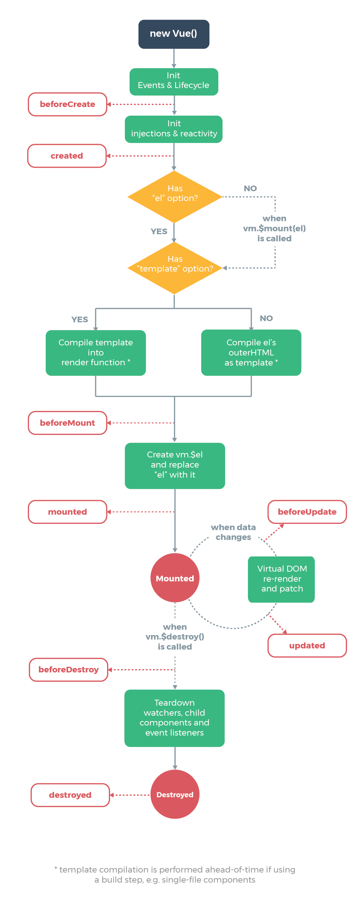

```
category:
  - 技术文章
tag:
  - Vue2
  - 语法基础
```
# Vue2基础零碎

> ![warning]
> 本文介绍的是基于Vue2的基础零碎，主要介绍基本语法

## Vue实例

Vue.js的核心是一个允许采用简洁的模板语法来声明式地将数据渲染进Dom的系统：

```html
<div id="app">
  {{ message }}
</div>
```

```js
var app =  new Vue({
	el: '#app',
	data: {
	message: 'Hello Vue!'
	}
})
```

这样我们就成功创建了第一个Vue应用

## 组件化应用

```js
Vue.component('todo-item'{
	template:'<li>这是一个组件<li>'
})

var app=new Vue(...)
```

这样就注册好了一个组件，可以在另一段代码中使用

```
<ol>
	<todo-item></todo-item>
<ol>
```

但是这样的缺点是每个待办项会被渲染相同的文本，也就是说组件里面的内容，一旦修改的话所有使用这个组件的地方都被修改了。我们往往需要定制修改一些东西，做法如下

```js
Vue.component('todo-item'{
	props:['todo'],
	template:'<li>{{todo.text}}<li>',
})
```

我们引入了conponent中的一个属性：props，这样我们就可以使用v-bind指令将待办项传到循环输出的每个组件中：

```js
var app7=new Vue({
	el:'app-7',
	data:{
		gorceryList:[
			{id:0,text:'蔬菜'},
			{id:1,text:'奶酪'},
			{id:2,text:'随便其他什么人吃的东西'}
		]
	}
})

<div id="app-7">
	<ol>
		<todo-item
			v-for="item in groceryList"
			v-bind:todo="item"
			v-bind:key="item.id"
		></todo-item>
	<ol>
</div>
```

## 生命周期钩子

在Vue实例化的过程中会有一个阶段，在不同的阶段会有不同的周期钩子，我们在钩子上挂载代码，从而帮助我们在不同的阶段执行不同的代码

```js
var app = new Vue{
	created:function(){
		console.log('我被创建了');
	}
}
```

上面就是一个对于生命周期钩子用法的演示

实际上的生命周期图如下：



## 模板语法

### 文本插值

最常见的方法就是通过两个大括号插值

```js
<span>{{msg}}</span>
```

当msg的property更新以后，对应文本内容就会改变

```js
<span v-once>{{msg}}</span>
```

通过 `v-once`可以实现一次性差值，以后不会改变

### html插值

如果想要输出html的话，需要用v-html标签

```js
<span v-html="rawHtml"></span>
```

但实际上这样并不安全

### Attribute插值

可以使用 `v-bind`来将某些属性绑定到标签上

```js
<span v-bind:id=1></span>
<button v-bind:name="alice"></span>
```

### 指令

指令就是v-开头的属性，前面的v-html和v-bind都是指令。

```js
<p v-if="seen">现在你看到我了</p>
<a v-bind:href="url"></a> //点击跳转到某个链接
<button v-on:click="handle"></button> //点击以后处理某个时间
```

其实你可以看出来，`v-bind:`后面的东西，实际上就是你写html的时候的那些标签里面的属性，只不过换了一种方式

> [!tip]
> 部分指令是有缩写的，比如 `v-bind:`可以直接缩写为 `:`，`v-on:`可以直接缩写为 `@`

## 计算属性和侦听属性

### 计算属性

我们可以将一段代码提取到计算属性中

```html
<div id="example">
  <p>Original message: "{{ message }}"</p>
  <p>Computed reversed message: "{{ reversedMessage }}"</p>
</div>
```

```js
var vm = new Vue({
	el: '#example',
	data:{
		message:'hello',
	},
	computed:{
		reversedMessage: function(){
			return this.message.split:('').reverse().join('')
		}
	}
})
```

其中 `computed`就是计算属性，在里面创建了 `reversedMessage`，并实际上给他赋予了函数的返回值。当我们再次调用 `vm.reversedMessage`就得到了message的翻转

> [!note]
> 我们可以同样将计算属性转换为方法，他们得到的结果是相同的，但是不同的是**计算属性是基于他们的响应式依赖进行缓存的**。这就意味着只要message不变，那么 `computed`里面的东西就不会再次执行，但是如果使用方法的话每次都会重新执行一遍，所以相对来说计算属性更加高效

### 侦听器

```js
var vm = new Vue({
	el: '#example',
	data:{
		message:'hello',
	},
	watch: {
    // 如果 `question` 发生改变，这个函数就会运行
    question: function (newQuestion, oldQuestion) {
      this.answer = 'Waiting for you to stop typing...'
      this.debouncedGetAnswer()
    },
})
```

实际上就是看某个变量有没有变化，如果变化了就执行这个函数

## v-model

`v-model`是vue中的一个非常重要的指令，用于在**表单输入**和**应用状态**之间建立双向绑定，可以确保表单输入的值和数据模型中的值保持同步。相当于同时绑定了 `value`属性和 `input`事件

```js
<template>
  <input v-model="message" placeholder="输入一些文本">
  <p>输入的消息是: {{ message }}</p>
</template>

<script>
export default {
  data() {
    return {
      message: ''
    }
  }
}
</script>
```

这样的话输入的信息可以实时显示出来

## 组件

- 组件的最大作用是可以复用，这也类似于函数或方法的复用，非常符合软件工程(#^.^#)

```js
// 引入Vue
import Vue from 'vue';

// 引入组件
import MyComponent from './MyComponent.vue';

// 全局注册组件
Vue.component('my-component', {
  data: function () {
    return {
      count: 0
    }
  },
  template: '<button v-on:click="count++">You clicked me {{ count }} times.</button>'
});

// 创建Vue实例
new Vue({
  el: '#app'
});
```

上述代码是对组件的全局注册，注册以后可以在任何地方使用，并且可以使用任意次数

使用方法如下：

```js
<template>
  <div>
    <my-component></my-component>
    <!-- 其他内容 -->
  </div>
</template>
```


> [!tip]
> 值得注意的是，在组件中的data必须是一个函数function，而不是直接返回变量和值
